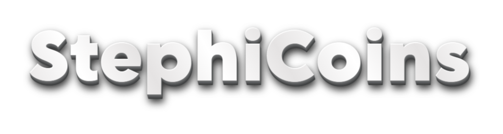
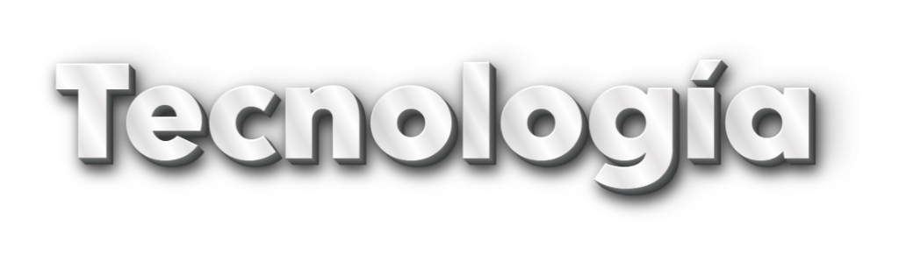

<br><br>
> Plataforma educativa con economía de monedas virtuales para motivar a los estudiantes.

---


## ¿Qué es StephiCoins?

StephiCoins es una aplicación web educativa que usa un sistema de **monedas virtuales** para incentivar la participación de los estudiantes. Los docentes crean tareas con valor en monedas, los estudiantes las completan y luego pueden canjear sus ganancias por beneficios reales dentro del aula.

---

## Objetivo

Aumentar la **motivación y participación estudiantil** a través de un sistema de recompensas gamificado, promoviendo un aprendizaje más autónomo y comprometido.

---

## Roles

| Rol | Descripción |
|-----|-------------|
| **Docente (Admin)** | Crea tareas, asigna monedas, aprueba entregas y gestiona recompensas |
| **Estudiante (User)** | Realiza tareas, acumula monedas y las canjea en la tienda |

---


## Funcionalidades principales

- **Gestión de tareas** — creación, edición y seguimiento de actividades
- **Sistema de aprobación** — el docente valida las entregas antes de acreditar monedas
- **Saldo de monedas** — seguimiento en tiempo real del balance de cada estudiante
- **Tienda de recompensas** — canje por puntos extra, posponer exámenes, saltear tareas, y más

---

## Flujo de uso

```
1. Docente crea una tarea con valor en monedas
        ↓
2. Estudiante la completa y envía
        ↓
3. Docente revisa y aprueba
        ↓
4. Estudiante recibe monedas y puede canjearlas
```

---



## Tecnología

| Capa | Tecnología |
|------|------------|
| **Backend** | Python — Flask / Django |
| **Frontend** | HTML, CSS, JavaScript |
| **Base de datos** | SQLite (desarrollo) / PostgreSQL (producción) |

---

## Fases de desarrollo

```
Fase 1 — Planificación
Fase 2 — Diseño
Fase 3 — Desarrollo
Fase 4 — Pruebas y despliegue
```

---

## Compatibilidad

- Funciona en el navegador — no requiere instalación
- Compatible con dispositivos móviles y computadoras

---

## Bugs conocidos

- El saldo de monedas no se actualiza automáticamente; se requiere recargar la página manualmente.

---

## Licencia

Este proyecto fue desarrollado con fines educativos.

---

<p align="center">Paulina Ramos, Ambar Torri, Tadeo Cerutti, Julián Funes and Mateo Ortega </p>
